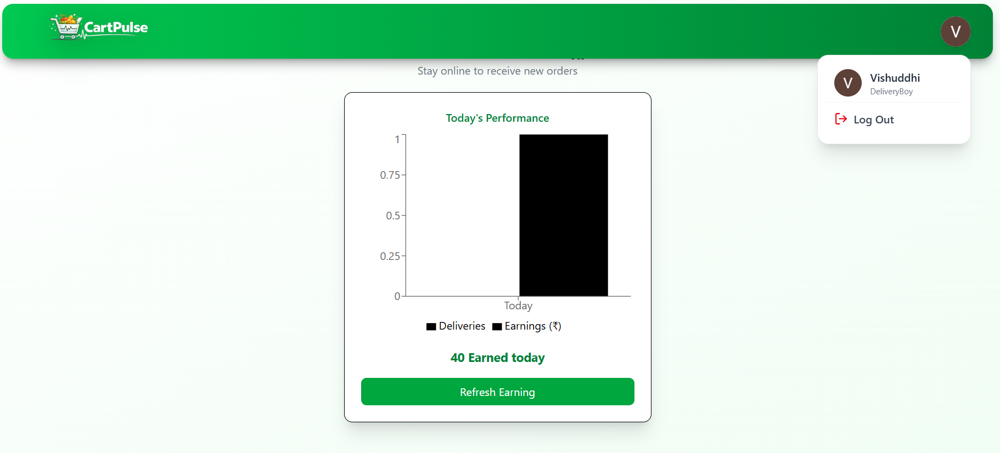
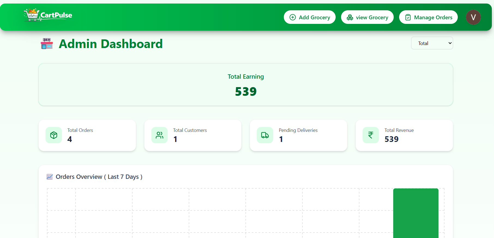
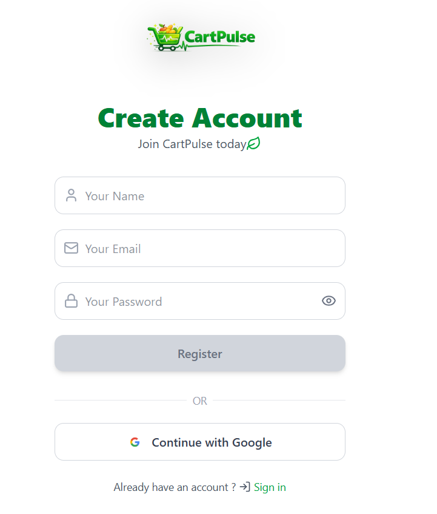
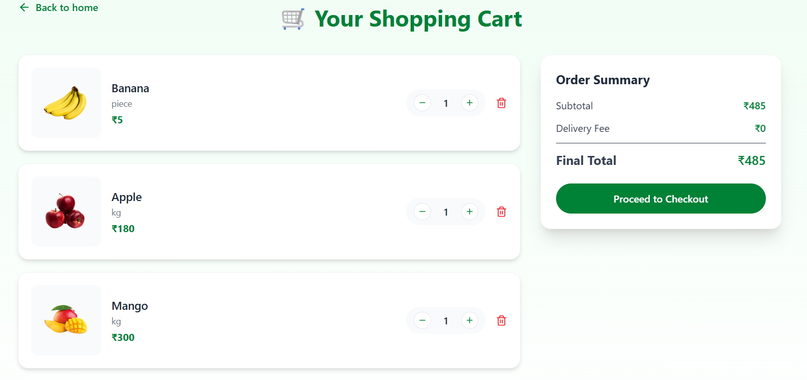
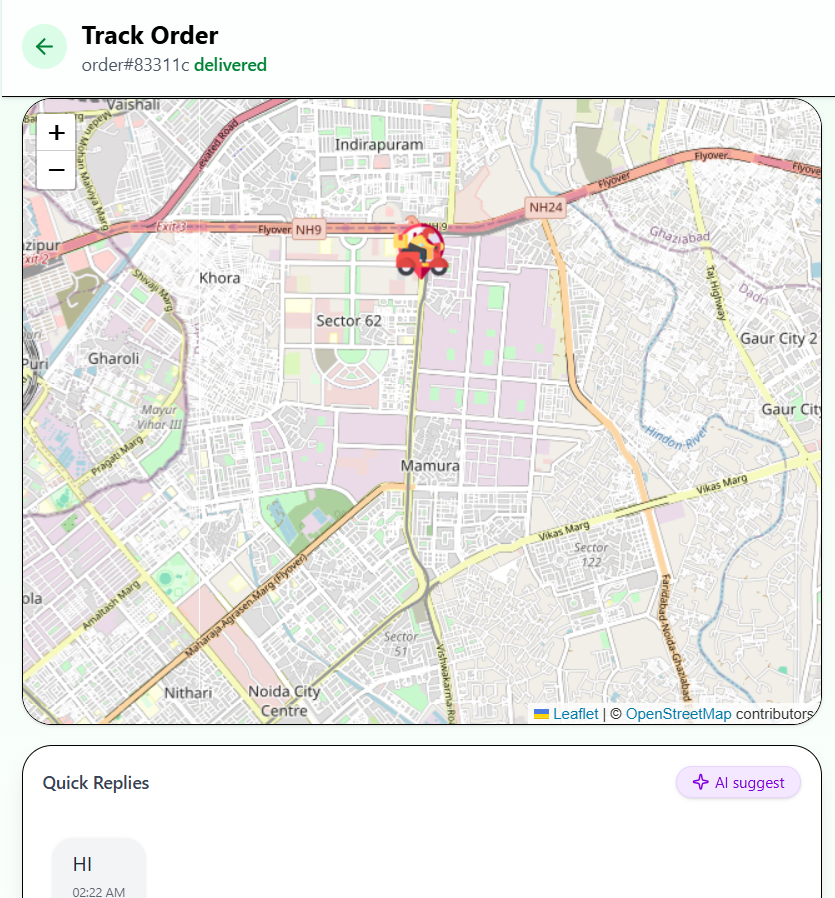

# 🛒 CartPulse

### ⚡ Real-Time Grocery Delivery Platform

<!-- Tech Stack Badges -->


**CartPulse** is a modern, full-stack grocery delivery application built with **Next.js 16 (App Router)** that delivers a seamless, real-time experience for **customers**, **delivery partners**, and **administrators**.

From browsing groceries to live delivery tracking on maps, CartPulse showcases how large-scale delivery platforms like Blinkit, Zepto, or Instamart work under the hood — with **real-time systems, role-based access, and scalable architecture**.

🌐 **Live Demo**
👉 **Frontend (Vercel):** [https://cartpulse-one.vercel.app](https://cartpulse-one.vercel.app)

---

## ✨ Features

### 🛍️ Customer Experience

* 🔍 Browse & search products by category with smart filtering
* 🛒 Smart cart with real-time price calculations
* 📍 Save multiple delivery addresses using interactive maps
* 💳 Secure and smooth checkout flow
* 🚚 Live order tracking with real-time delivery location
* 🧾 Order history with one-click reordering
* 🔐 OTP-based email verification
* 💬 Real-time chat with delivery partner + AI suggestions

---

### 🚚 Delivery Partner Dashboard

* 🔔 Instant order notifications (Socket.io)
* 📦 Accept, reject, and update order status
* 🗺️ Live delivery location tracking
* 💰 Earnings & delivery history dashboard
* 🧭 Route optimization with maps
* 💬 Real-time chat with customer + AI suggestions
* 🔑 OTP verification at delivery

---

### 👨‍💼 Admin Panel

* 🧑‍💻 User & delivery partner management
* 📦 Product & category management
* 🖼️ Image uploads via Cloudinary
* 📊 Analytics dashboard (orders, sales, performance)
* 🧾 Global order monitoring

---

## 🔐 Authentication & Security

* 🔑 NextAuth.js with JWT sessions
* 👥 Role-based access (Customer / Delivery / Admin)
* 🔐 Google OAuth login
* 📩 Email OTP verification
* 🛡️ Middleware-based protected routes

---

## 🌐 Real-Time Capabilities

* ⚡ Socket.io WebSockets (no polling)
* 📍 Live delivery tracking on maps
* 🔔 Instant order status updates
* 👥 Multi-user concurrent order handling

---

## 🛠️ Tech Stack

### Frontend

* **Next.js 16** (App Router)
* **React 18**
* **Tailwind CSS 4**
* **Framer Motion**
* **Lucide React**
* **React Leaflet & Google Maps API**

### Backend

* **Node.js**
* **MongoDB + Mongoose**
* **NextAuth.js**
* **Socket.io**
* **Cloudinary**
* **Nodemailer**
* **Google Gemini AI**

### Dev Tools

* npm
* Git & GitHub

---

## 🚀 Getting Started

### Prerequisites

* Node.js **18+**
* MongoDB Atlas
* npm / yarn

### Installation

```bash
git clone https://github.com/Vishuddhijain/CartPulse.git
cd cartpulse
npm install
```

### Environment Variables (`.env.local`)

```env
MONGODB_URL=

AUTH_SECRET=
NEXTAUTH_URL=http://localhost:3000

NEXT_PUBLIC_SOCKET_SERVER=

CLOUDINARY_CLOUD_NAME=
CLOUDINARY_API_KEY=
CLOUDINARY_API_SECRET=

GOOGLE_CLIENT_ID=
GOOGLE_CLIENT_SECRET=

NEXT_PUBLIC_GOOGLE_MAPS_API_KEY=

EMAIL=
PASS=

GEMINI_API_KEY=
```

### Run Locally

```bash
npm run dev
```

Visit 👉 [http://localhost:3000](http://localhost:3000)

---

## 🎯 Key User Workflows

### 🛍️ Customer

1. Register & verify email
2. Browse products
3. Add items to cart
4. Select delivery address on map
5. Checkout
6. Track order live
7. Chat with delivery partner (AI-assisted)
8. Reorder from history


---

### 🚚 Delivery Partner

1. Receive real-time order alerts
2. Accept or reject orders
3. Update delivery status
4. Share live location
5. Chat with customer (AI-assisted)
6. Verify OTP
7. Track earnings



---

### 👨‍💼 Admin

1. Manage products & categories
2. Create delivery partner accounts
3. Monitor all orders
4. Analyze platform performance



---

## 📸 Screenshots

### 🔑 Authentication

* Google OAuth Signup
  

### 🛍️ Customer Flow

* Cart Page
  

* Checkout & Live Tracking
  

---

## 🌍 Deployment

### Frontend (Vercel)

* GitHub-connected CI/CD
* Auto-deploy on push
* 🔗 [https://cartpulse-one.vercel.app](https://cartpulse-one.vercel.app)

### Socket Server (Render)

* Node.js service on Render
* Handles real-time communication
* Connected via environment variables

---

## 🤝 Contributing

Pull requests are welcome!
Feel free to open issues or suggest enhancements.

---

## 📄 License

© 2025 CartPulse. All rights reserved.

---

## 🙏 Acknowledgements

* Next.js & Vercel
* Socket.io
* MongoDB
* Cloudinary
* Google Maps
* Inspired by modern instant-delivery platforms

---
